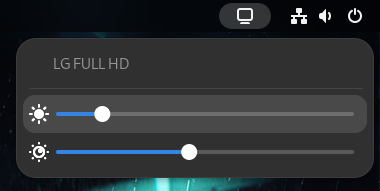

# Set Monitor DDC Brightness/Contrast



- Slider 1: Brillo / Brightness
- Slider 2: Contraste / Contrast

## Intalación / Installation

### ddcutil

Es necesario instalar y realizar la siguiente configuracion antes de poder usar la extensión.

You need to install and configure the following settings before you can use the extension.

``` bash
sudo apt install ddcutil
sudo modprobe i2c-dev
sudo usermod -aG i2c $USER
```

### Cerrar sesión / Log out

Es necesario cerrar la sesión después del proceso de instalación para que la extensión funcione.

You need to log out/log in after doing all the installation and configuration procedure for this extension to work.

## Acerca de / About

La extensión es un **FORK** del [proyecto de tzawezin](https://github.com/tzawezin/gnome-ddc-brightness-contrast-extra-dimming) (Versión 15 y 16).  

Se realiza con la intención de eliminar el slider de "Extra dimm", cambiar iconos y mejorar aspecto visual en general.

---

The extension is a **FORK** of [tzawezin's project](https://github.com/tzawezin/gnome-ddc-brightness-contrast-extra-dimming) (Version 15 and 16).

This fork was created to remove the "Extra Dim" slider, change icons, and improve the overall visual appearance.